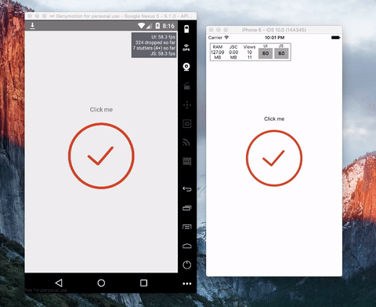

# ReactNativeSVGAnimation
React Native demo of check icon animation by using svg 🎉

# Demo

# How to run this project?
- Clone this repo.
- Run `npm install`.
- Link `svg` package by running `react-native link react-native-svg`  
Then enjoy 😎

# Preferences
- [Basic transitions](http://xaedes.de/dev/transitions/)
- [React Native animation book](http://browniefed.com/react-native-animation-book/)
- [React Native SVG package](https://github.com/react-native-community/react-native-svg)
- [React Native Animated docs](https://facebook.github.io/react-native/docs/animated.html)
- [React Native Animations docs](https://facebook.github.io/react-native/docs/animations.html)
- [How SVG Line animation works](https://css-tricks.com/svg-line-animation-works/)
- [React Native ART and D3](http://hswolff.com/blog/react-native-art-and-d3/)
- [Origin animation](http://moarwick.github.io/react-mt-svg-lines/)
- [SVG animation in details](https://css-tricks.com/guide-svg-animations-smil/)
- [Geting React ART on React Native](http://browniefed.com/blog/getting-react-art-running-on-react-native/)
- [React Native morphing svg path with React ART](http://brow- [Hambuger button animation in Swift](http://robb.is/working-on/a-hamburger-button-transition/)niefed.com/blog/react-native-morphing-svg-paths-with-react-art/)
- [Hambuger button animation in Swift](http://robb.is/working-on/a-hamburger-button-transition/)
- [🎥 React Native @ 60fps](https://www.youtube.com/watch?v=qgSMjYWqBk4)
